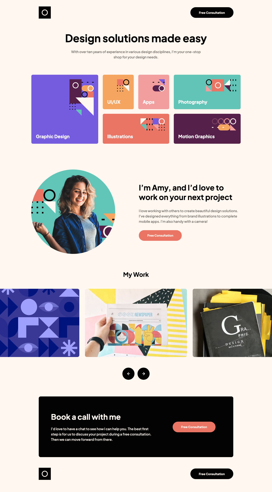

# Single-page design portfolio solution

This is a solution to the [Single-page design portfolio challenge on Frontend Mentor](https://www.frontendmentor.io/challenges/singlepage-design-portfolio-2MMhyhfKVo). Frontend Mentor challenges help you improve your coding skills by building realistic projects.

This project showcases a sleek, modern design portfolio, developed using HTML, CSS (with Sass/Scss for enhanced styling), and JavaScript, ensuring a responsive experience across all devices. JS is particularly utilized to power the image slider, adding interactivity to the portfolio showcase.

## Links

| Hosted using GitHub Pages: | [Live Demo URL](https://ionstici.github.io/single-page-design-portfolio) | [Frontend Mentor](https://www.frontendmentor.io/solutions/singlepage-design-portfolio-lOGtLJfZUR) |
| -------------------------- | ------------------------------------------------------------------------ | ------------------------------------------------------------------------------------------------- |

## Built With

- **HTML5:** For structuring the content of the page.
- **CSS3 with Sass/Scss:** For styling, providing a more efficient way to manage styles with variables, mixins, and nested rules.
- **JavaScript:** To create an interactive image slider for showcasing portfolio items.

## Features

- **Responsive Design:** Optimized for viewing on any device, from mobile phones to desktops.
- **Interactive Image Slider:** JavaScript-driven slider to display work samples dynamically.
- **Clean, Modern Layout:** Uses a minimalist aesthetic to highlight design work effectively.
- **Call to Action:** Includes buttons for booking consultations, enhancing user engagement.

## Demo

